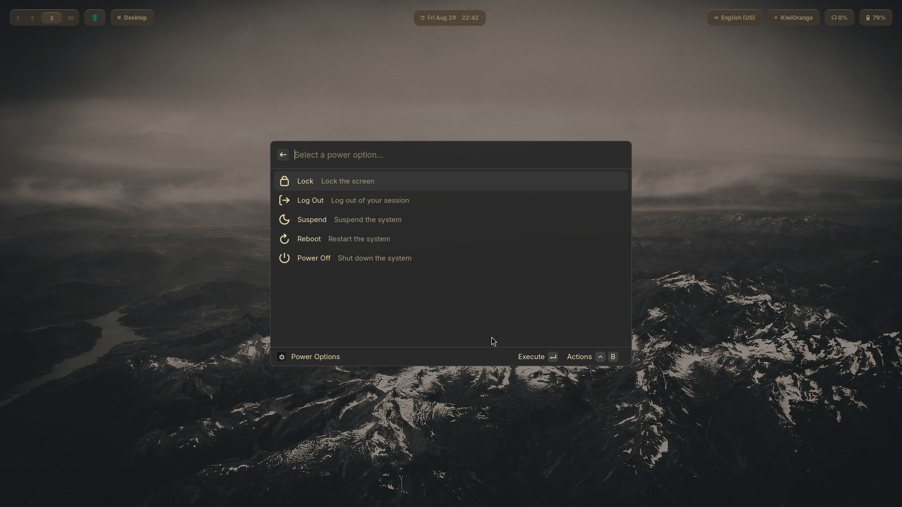

# Vicinae Power Menu


Vicinae Power Menu is a dedicated power menu for [**Vicinae**](https://github.com/vicinaehq/vicinae), designed to integrate seamlessly with your environment. It allows you to control your session easily within the launcher.



## Prerequisites

Before installing Vicinae Power Menu, make sure your system has the following:


- Linux (tested on CachyOS, an Arch derivative, but should work on most distros)
- `systemd` (other init systems are not supported unless you edit the helper script yourself)
- Wayland (supports Hyprland, Sway, GNOME, and Plasma); X11 has not been tested on

### Software Dependencies

- Node.js
- Vicinae
- Bash

## Installation

1. Clone the repository:

```bash
git clone https://github.com/v81d/vicinae-power-menu.git
cd vicinae-power-menu
```

2. Copy the helper script to `~/.local/share/vicinae-power-menu`:

```bash
mkdir -p ~/.local/share/vicinae-power-menu
cp scripts/helper.sh ~/.local/share/vicinae-power-menu
chmod +x ~/.local/share/vicinae-power-menu/helper.sh
```

3. Install dependencies:

```bash
npm install
```

4. Build the bundle:

```bash
npm run build
```

## Setup

Set the script to automatically run as a daemon. Steps vary depending on your desktop environment or window manager:

```ini
exec-once = ~/.local/share/vicinae-power-menu/helper.sh  # For Hyprland
```

You can also create a dedicated `~/.config/autostart` service that calls the script on startup.

## License

This project is licensed under the **MIT License**.

You are free to use, copy, modify, merge, publish, distribute, sublicense, and/or sell copies of this software, provided that the original copyright notice and this permission notice are included in all copies or substantial portions of the software.

For the full license text, see https://mit-license.org.
